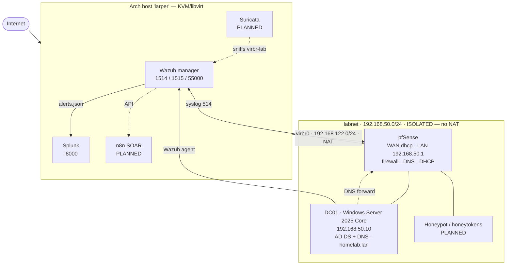

# soc-homelab

A self-built **Home SOC / security lab** for detection engineering, log analysis and
incident investigation — a segmented virtual network (pfSense firewall + Active
Directory domain) monitored by a SIEM stack (Wazuh + Splunk), used to run attacks
against and then hunt them.

> **Status:** 🔴 all systems offline — build in progress.
> Nothing in this repository is claimed as working until it is verified and
> screenshotted. See **[STATUS.md](STATUS.md)**.

---

## Architecture

The lab segment has **no NAT of its own by design** — the only route out is through
the firewall. That property is what makes it safe to run hostile workloads later.

---

## Phases

| # | Phase | What it delivers | Status |
|---|---|---|---|
| 0 | **Previous work** | earlier labs — honeypot, n8n, first AD build | 📦 ARCHIVED |
| 1 | **Foundation** | host · libvirt · pfSense · AD-DC, booting and verified | 📋 PLANNED |
| 2 | **Telemetry** | Wazuh agent · Sysmon · audit policy · pfSense syslog | 📋 PLANNED |
| 3 | **Detection** | Suricata · custom rules · MITRE ATT&CK coverage | 📋 PLANNED |
| 4 | **Deception** | honeytokens, then a containerised honeypot | 📋 PLANNED |
| 5 | **Automation** | n8n SOAR — enrich, notify, contain | 📋 PLANNED |
| 6 | **Practice** | attack → hunt → harden loop, written up | 📋 PLANNED |

Full detail and exit criteria: **[ROADMAP.md](ROADMAP.md)**

---

## Repository map

| Folder | Security function |
|---|---|
| [`docs/`](docs/) | architecture, network design, decision log |
| [`infrastructure/`](infrastructure/) | host, libvirt, VM lifecycle, snapshots |
| [`firewall/`](firewall/) | pfSense + Suricata |
| [`identity/`](identity/) | Active Directory, GPO, Sysmon, audit policy |
| [`siem/`](siem/) | Wazuh (primary) · Splunk (secondary) |
| [`detection/`](detection/) | rules, Sigma, MITRE coverage, validation |
| [`deception/`](deception/) | honeytokens and honeypots |
| [`automation/`](automation/) | n8n SOAR playbooks |
| [`operations/`](operations/) | runbooks, daily checks, investigations |
| [`evidence/`](evidence/) | screenshots proving each verified claim |
| [`archive/`](archive/) | ⚠️ previous labs — **not the current environment** |
| [`scripts/verify/`](scripts/verify/) | verification scripts — exit 0 = healthy |
| [`lab-journal/`](lab-journal/) | dated build log: what I did, what broke |

---

## Upstream projects used

| Project | Role | Link |
|---|---|---|
| pfSense CE | firewall, router, DNS, DHCP | https://www.pfsense.org |
| Wazuh | XDR/SIEM — agents, rules, ATT&CK mapping | https://wazuh.com |
| Suricata | network IDS | https://suricata.io |
| Splunk (Free) | search + dashboards | https://www.splunk.com |
| Sysmon | Windows endpoint telemetry | https://learn.microsoft.com/sysinternals |
| SwiftOnSecurity sysmon-config | Sysmon baseline configuration | https://github.com/SwiftOnSecurity/sysmon-config |
| Windows Server 2025 (eval) | Active Directory domain controller | https://microsoft.com |
| n8n | SOAR / workflow automation | https://n8n.io |
| Atomic Red Team | detection validation | https://github.com/redcanaryco/atomic-red-team |
| MITRE ATT&CK | detection coverage framework | https://attack.mitre.org |

*Versions are recorded in each folder's README as they are deployed.*

---

## My work in this lab

*(This section is filled in as each phase is verified — it is deliberately empty
until there is something real to describe.)*

- Network segmentation and firewall policy design
- Custom Wazuh detection rules
- Suricata rule tuning for this environment
- n8n SOAR playbooks
- Incident investigation writeups → [`operations/investigations/`](operations/investigations/)

---

## Previous work

Earlier labs live in [`archive/`](archive/) — a honeypot lab, n8n automation work,
and the first pfSense + AD + Wazuh + Splunk build. They are kept for reference and
for migrating useful components. **None of them are running.** This repository
documents one lab: the one described above.
