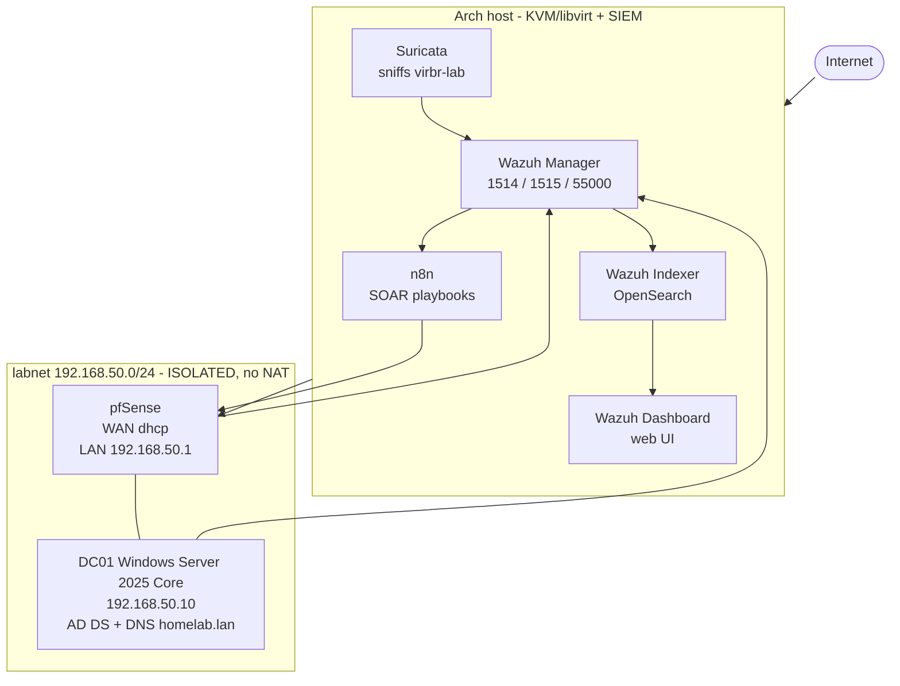

# soc-homelab

A self-built **Home SOC / security lab** for detection engineering, log analysis and
incident investigation — a segmented virtual network (pfSense firewall + Active
Directory domain) monitored end-to-end by **Wazuh**.

> **Status:** BUILDING — Phase 1 verified, Phase 2 starting.
> Nothing here is claimed as working until it is verified by a script and
> screenshotted. Live state: **[STATUS.md](STATUS.md)**.

---

## Architecture



<details>
<summary>Text version of the topology</summary>

```
Internet
 |
Arch host (KVM/libvirt)  --  Wazuh Manager + Indexer + Dashboard
 | Suricata (sniffs virbr-lab)

 | virbr0 192.168.122.0/24 (NAT) host is also 192.168.50.2 on labnet
 |
pfSense   WAN dhcp / LAN 192.168.50.1   <-- only route out of the lab
 |
   +-- DC01  192.168.50.10   Windows Server 2025 Core, AD DS + DNS (homelab.lan)

Telemetry:  DC01 (Wazuh agent 1514) ---+
            pfSense (syslog 514) ------+--> Wazuh Manager --> Indexer --> Dashboard
            Suricata (host) -----------+
                                            |
                                            +--> n8n SOAR --> back to pfSense / AD
```
</details>

The lab segment has **no NAT of its own by design** — the only route out is through
the firewall. That is what makes it safe to run hostile workloads later.

---

## Build phases

Building first. Practice and adversary emulation come after the platform is complete.

| # | Phase | Delivers | Status |
|---|---|---|---|
| 0 | **Previous work** | earlier pfSense + AD + Wazuh build | ARCHIVED |
| 1 | **Foundation** | host · libvirt · pfSense · AD-DC, verified | BUILDING |
| 2 | **SIEM platform** | Wazuh manager + indexer + dashboard | PLANNED |
| 3 | **Telemetry** | Wazuh agent · Sysmon · audit policy · pfSense syslog | PLANNED |
| 4 | **Network IDS** | Suricata on host, tuned | PLANNED |
| 5 | **Detection** | custom rules · MITRE ATT&CK coverage | PLANNED |
| 6 | **SOAR** | n8n playbooks — enrich · notify · contain | PLANNED |

Coming back after a break: **[RESUME.md](RESUME.md)**
Full detail and exit criteria: **[ROADMAP.md](ROADMAP.md)**
Step-by-step build instructions: **[docs/SETUP-GUIDE.md](docs/SETUP-GUIDE.md)**

---

## Repository map

| Folder | Security function |
|---|---|
| [`docs/`](docs/) | architecture · network design · setup guide · decision log |
| [`infrastructure/`](infrastructure/) | host, libvirt, VM lifecycle, snapshots |
| [`firewall/`](firewall/) | pfSense + Suricata |
| [`identity/`](identity/) | Active Directory, GPO, Sysmon, audit policy |
| [`siem/`](siem/) | Wazuh — manager, indexer, dashboard |
| [`detection/`](detection/) | rules, Sigma, MITRE coverage, validation |
| [`automation/`](automation/) | n8n SOAR playbooks — enrich, notify, contain |
| [`evidence/`](evidence/) | screenshots proving each verified claim |
| [`archive/`](archive/) | NOTE: previous labs — **not the current environment** |
| [`scripts/`](scripts/) | lab start/stop + verification scripts |

---

## Upstream projects used

| Project | Role |
|---|---|
| [pfSense CE](https://www.pfsense.org) | firewall, router, DNS, DHCP |
| [Wazuh](https://wazuh.com) | SIEM/XDR — manager, indexer, dashboard, agents, ATT&CK mapping |
| [Suricata](https://suricata.io) | network intrusion detection |
| [Sysmon](https://learn.microsoft.com/sysinternals) | Windows endpoint telemetry |
| [SwiftOnSecurity sysmon-config](https://github.com/SwiftOnSecurity/sysmon-config) | Sysmon baseline |
| Windows Server 2025 (eval) | Active Directory domain controller |
| [n8n](https://n8n.io) | SOAR / response automation |
| [MITRE ATT&CK](https://attack.mitre.org) | detection coverage framework |

*Versions are recorded in each folder's README as they are deployed.*

---

## My work in this lab

*(Filled in as each phase is verified — deliberately empty until there is something
real to describe.)*

- Network segmentation and firewall policy design
- Custom Wazuh detection rules
- Suricata rule tuning for this environment
- SOAR playbooks that enrich and contain, with a tested reverse for every action

---

## Previous work

The first pfSense + AD + Wazuh build lives in [`archive/`](archive/), kept for
reference and component migration. **It is not running.** This repository
documents one lab: the one above.
