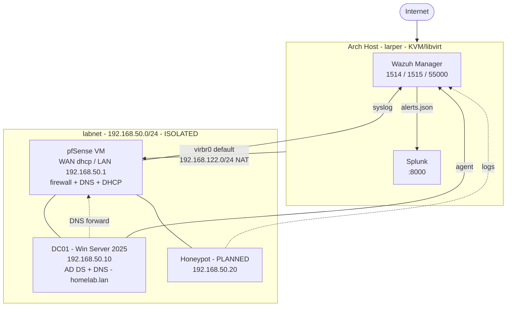

> ARCHIVED **ARCHIVED — previous work, not the current environment.**
> Kept for reference and component migration. Any status claims below
> reflect 2026-08-08 and are **not** current. Live status: [STATUS.md](../../STATUS.md)

---

# Homelab Rebuild — Progress Update
**Date:** 2026-08-08 · Day update for 75 Hard

---

## TL;DR

Rebuilt the lab from scratch into a properly segmented setup: a **pfSense firewall**
fronting an **isolated lab network**, with a **Windows Server 2025 Active Directory
domain controller** behind it, and **Wazuh + Splunk** on the host doing detection and
search. Core infrastructure is up and verified end-to-end. Now moving into the
telemetry layer — getting logs off the boxes and into the SIEM.

---

## The Flowchart

### Network + traffic flow

```
                          ┌───────────────────────┐
                          │       INTERNET        │
                          └───────────┬───────────┘
                                      │
                          wlp0s20f3 · 10.94.63.108/24
                                      │
        ╔═════════════════════════════▼══════════════════════════════╗
        ║  ARCH HOST "larper"  ·  KVM/libvirt hypervisor             ║
        ║  ┌──────────────┐   ┌──────────────┐                       ║
        ║  │Wazuh manager │   │   Splunk     │   ← detection + search║
        ║  │  :1514/:1515 │   │    :8000     │                       ║
        ║  └──────────────┘   └──────────────┘                       ║
        ╚══╦═══════════════════════════════════════╦═════════════════╝
           ║ virbr0 "default"                      ║ virbr-lab "labnet"
           ║ 192.168.122.1/24  (NAT ⇄ internet)    ║ 192.168.50.2/24
           ║                                       ║ (ISOLATED — no NAT)
           ║                                       ║
      ┌────▼────┐  WAN vtnet0                      ║
      │         │  DHCP                            ║
      │ pfSense │                                  ║
      │   VM    │  ── firewall · router            ║
      │         │  ── DNS resolver                 ║
      │         │  ── DHCP server                  ║
      └────┬────┘  LAN vtnet1 · 192.168.50.1/24    ║
           └───────────────────┬───────────────────╨──────┐
                               │  labnet L2 segment       │
                    ┌──────────▼──────────┐     ┌─────────▼─────────┐
                    │  DC01               │     │  (planned)        │
                    │  Win Server 2025    │     │  Honeypot         │
                    │  192.168.50.10      │     │  192.168.50.20    │
                    │  AD DS + DNS        │     │  Cowrie/Dionaea   │
                    │  domain homelab.lan │     └───────────────────┘
                    └─────────────────────┘
```

### DNS resolution chain
```
  client  ──►  DC01 DNS (.10)  ──►  pfSense resolver (.1)  ──►  host NAT  ──►  internet
               authoritative        forwarder
               for homelab.lan
```

### Log / detection flow
```
  DC01  ──Wazuh agent (1514/tcp)──┐
                                  ├──►  WAZUH MANAGER  ──► alerts.json ──►  SPLUNK
  pfSense ──syslog (514/udp)──────┘      rules/decoders                     index=wazuh
                                         MITRE mapping                      dashboards
  Honeypot (planned) ─────────────┘                                         + search
```

### Mermaid version (paste into mermaid.live / GitHub for a rendered image)



---

## What each piece does (short version)

**pfSense** — the gatekeeper. Two NICs: WAN on the NAT network (that's its only path
out), LAN at 192.168.50.1 serving the lab segment. Everything the lab does to reach
the internet has to pass through it, which means every packet is inspectable and
blockable. It's also the DNS resolver and DHCP server for the segment.

**labnet** — deliberately built with **no NAT of its own**. That's the whole point:
there is no accidental path to the internet. If pfSense is down, the lab is dark.
That property is what makes it safe to run malware/honeypot workloads later.

**DC01** — Windows Server 2025 Core (no GUI, PowerShell only — which turned out to be
a good forcing function). Runs Active Directory Domain Services and DNS for
`homelab.lan`. It's authoritative for the internal zone and forwards everything else
to pfSense. This is the correct AD DNS pattern and it's the part people most often
get wrong — point domain members at a public resolver and domain join silently breaks.

**Wazuh** — the detection engine. Agents on endpoints ship events, the manager runs
them through rules/decoders and produces alerts mapped to MITRE ATT&CK.

**Splunk** — the search and dashboard layer. Wazuh's alert stream feeds into it so
there's one place to pivot across firewall logs, Windows events, and honeypot hits.

---

## Verified working today

| Check | Result |
|---|---|
| pfSense + DC01 VMs running | DONE |
| pfSense LAN reachable (192.168.50.1) | DONE 0% loss |
| pfSense Web GUI | DONE HTTP 200 |
| DC01 reachable (192.168.50.10) | DONE 0% loss |
| Internal DNS `dc01.homelab.lan` | DONE → 192.168.50.10 |
| External DNS via DC (`archlinux.org`) | DONE → 209.126.35.79 |
| AD SRV `_ldap._tcp.homelab.lan` | DONE → 0 100 389 dc01.homelab.lan |
| AD SRV `_kerberos._tcp.homelab.lan` | DONE → 0 100 88 dc01.homelab.lan |
| Wazuh manager | DONE active, listening 1514/1515/55000 |
| Splunk | DONE running, web on :8000 |

Those SRV records are the real proof AD is healthy — they're what domain clients use
to *find* the DC in the first place.

---

## What broke along the way (the actual learning)

1. **DNS was dead at the start** — couldn't even download the pfSense ISO. Root cause
   had to be fixed before anything else could move.
2. **pfSense re-ran its installer after reboot** — the install ISO was still attached
   as the boot device. Had to detach the CDROM and fix boot order.
3. **Installed Windows Server Core by accident** (missed the Desktop Experience
   option). Chose to keep it rather than reinstall — everything since has been done
   through PowerShell, which is more useful practice anyway.
4. **Interface assignment on pfSense** — two NICs, and picking the wrong one for WAN
   vs LAN produces a lab that looks alive but routes nothing.
5. **Web GUI wasn't reachable until the host had an address on the LAN segment.**

Theme: every single failure was a *layer* problem — physical/virtual NIC, then L3
addressing, then DNS, then service. Working bottom-up every time is what solved them.

---

## Design decision: no Wazuh dashboard on this host

The Wazuh web UI requires the Wazuh indexer (OpenSearch). Current host memory:

```
total 15Gi · used 13Gi · available 2.1Gi · swap 4.0Gi FULLY consumed
(pfSense 1GB + DC01 4GB already allocated)
```

Adding OpenSearch + dashboard would OOM the box. **Decision: Splunk is the single
pane of glass**, and Wazuh's alert stream feeds into it. Same visibility, a fraction
of the RAM. If the lab moves to dedicated hardware later, the Wazuh dashboard goes
back in.

This is the kind of tradeoff worth writing down — "install everything" is not a plan.

---

## Next up (immediate)

1. Wazuh alerts → Splunk (`index=wazuh`)
2. pfSense remote syslog → Wazuh manager
3. Wazuh agent on DC01 → Windows Security events flowing
4. Snapshot both VMs now that they're healthy
5. pfSense DHCP scope handing out DC01 as DNS

## Roadmap

**Tier 1 — Visibility**
- Sysmon on DC01 (SwiftOnSecurity config)
- Windows Advanced Audit Policy: logon events, 4688 process creation, 4104 PowerShell
- Confirm a deliberately failed logon shows up in Splunk end-to-end

**Tier 2 — Honeypot migration** (bringing the old lab's honeypot into this design)
- Rebuild as its own VM at 192.168.50.20
- Cowrie (SSH/Telnet) + Dionaea (malware capture) on a small Debian VM
- **Firewall it off from DC01** — pfSense alias `HONEYPOT`, rule `HONEYPOT → LAN = BLOCK`.
  A honeypot that can reach the domain controller is just a compromised host.
- Port-forward from pfSense WAN so it actually gets probed
- "Attacks seen today" dashboard in Splunk

**Tier 3 — Adversary emulation**
- Kali VM on labnet as attacker box
- BloodHound collection, Kerberoasting, AS-REP roasting, LLMNR poisoning (Responder),
  pass-the-hash
- Hunt each one afterward in Wazuh/Splunk — the point isn't running the attack, it's
  whether the detection fired
- Atomic Red Team for repeatable technique-by-technique testing
- Track MITRE ATT&CK coverage as it grows

**Tier 4 — Harden and re-test**
- CIS/STIG baseline on DC01, re-run every Tier 3 attack, see what stops working
- LAPS, tiered admin model, gMSA
- Suricata IDS + pfBlockerNG on pfSense

---

## Operating rules I'm holding myself to

1. Snapshot before every experiment
2. Every IP and credential documented in the repo — lost time twice to "which NIC was WAN?"
3. One change, one verification. Never stack three changes then test.
4. Time sync everywhere — Kerberos dies silently on clock skew
5. Lab creds never touch anything real
6. Keep labnet isolated. The only way out is through the firewall, by design.
7. Logs live on the host, not the VM. VMs get rebuilt; evidence shouldn't vanish.
